# BLEhound Analyzer (desktop app)

**BLEhound Analyzer** is the desktop application for the BLEhound dongle: Wireshark 4.6
rebuilt around the sniffer. It talks to the boards itself — no Python, no `extcap`
plugin — and adds the panels a BLE sniffer needs: live device list, connection view
with a channel heat map, request/response transactions, on-host decryption and
firmware update. Everything Wireshark can do with a BLE capture still works.

Installers: `BLEhound-Analyzer-<version>-x64.exe` for Windows 10/11 (installs side by
side with a stock Wireshark, no Npcap needed) and `BLEhound Analyzer.app` for macOS.
The UI follows the system language (English / 中文); the screenshots below are from a
Chinese system.

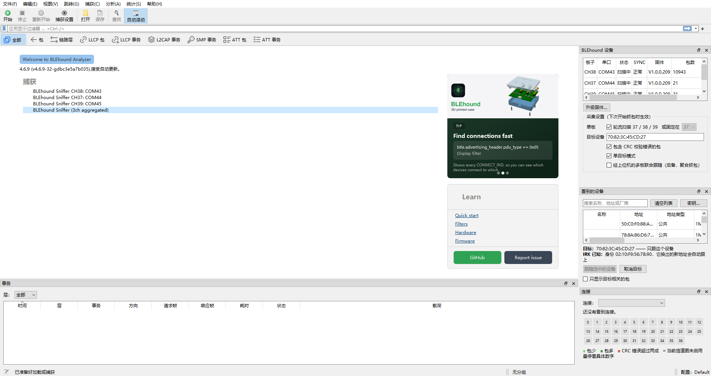

## First launch

Plug the dongles in and start the app. Every board appears as its own capture
interface — **BLEhound Sniffer CH37 / CH38 / CH39: COMx** — and, with two or more
boards, a **3ch aggregated** interface that merges them into one stream. The
aggregated interface is selected by default; press **Start**.

The sidebar on the welcome page cycles through short tips (display filters, hardware
notes) and links to this documentation.

## Showing and hiding the panels

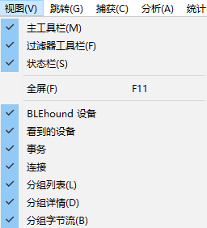

The four BLEhound panels — **BLEhound Devices**, **Devices Seen**, **Transactions**
and **Connection** — are dock widgets. Tick or untick them in the **View** menu, next
to Wireshark's own packet list, packet details and packet bytes; a panel can also be
closed with the × in its title bar or floated out of the main window with the ⧉
button. Your choice is remembered across restarts.

## The BLEhound Devices panel

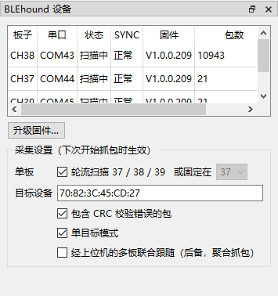

The top-right panel lists the attached boards with the channel each one guards, its
serial port, state (*Scanning* while idle, *Capturing*, *Idle*), the SYNC line status,
the firmware version and the packet count of the current session. Boards are learnt
from the first frame they send; before that they are ordered by port.

Below it, **capture settings** (applied at the next start):

- **Single board** — hop over 37 / 38 / 39, or stay on one advertising channel.
- **Target device** — follow only this address. Filled in from the *Devices Seen*
  panel with one click.
- **Include CRC-error packets** — keep malformed packets, useful when diagnosing weak
  signals.
- **Single-target mode** — the dongle follows one connection at a time.
- **Host follow relay** — fallback for the aggregated capture; the boards normally hand
  a caught `CONNECT_IND` to each other over their inter-board link themselves.

**Update firmware…** opens the [firmware update](#firmware-update) dialog.

## Devices Seen

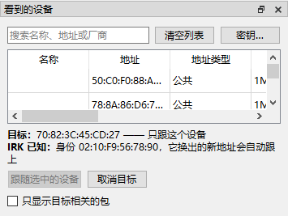

The dongles keep listening while no capture runs, so this list is live as soon as a
board is plugged in. Each row is one device: name, address, address type (public,
static, RPA, NRPA), PHY, company, and when it was last seen; devices that go quiet are
dropped after a while. Type in the search box to filter by name, address or company;
double-click a name to give a device your own label.

Select a device and press **Follow selected**: it becomes the capture target for every
board. If the device rotates resolvable private addresses and its IRK is known
(see *Keys*), the list shows **one row per identity** and the sniffer keeps following
the device through address changes. **Show only the target's traffic** applies a
matching display filter to the packet list.

## Device Keys

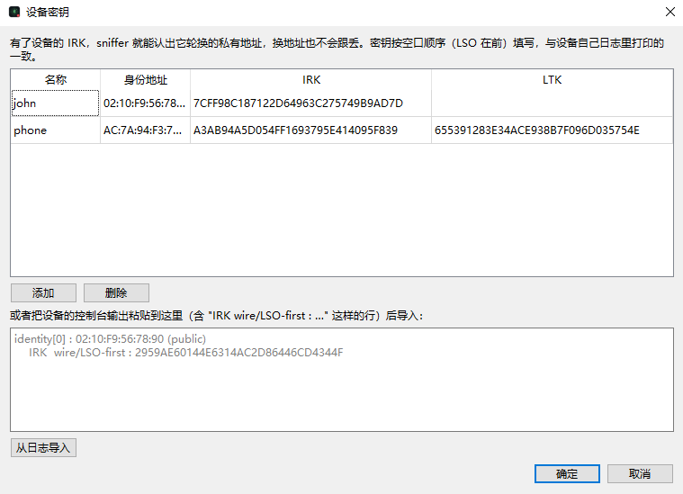

**Keys…** opens the key store. For each device you can enter its identity address,
**IRK** and **LTK**:

- **Following a device that uses resolvable private addresses (RPA) needs its IRK.**
  Such a device changes its address every few minutes; without the IRK the target
  filter is tied to one address and the sniffer loses the device at the next rotation.
  With the IRK the sniffer resolves every new address back to the identity, *Devices
  Seen* shows one row per identity, and the follow continues across rotations.
- **Decrypting a followed connection needs its LTK.** While capturing, the host
  decrypts the link with the LTK, writes plaintext into the capture file, and hands the
  decrypted control PDUs (channel map, connection parameter and PHY updates) back to
  the dongle so it can follow the encrypted connection through those updates.

**Expect two passes on a new device.** The first time you follow it you usually do not
have the LTK yet: the link encrypts, the dongle cannot read the encrypted control PDUs
and the follow is likely lost at the next channel map or parameter update. Take the
LTK from one of the two devices (its pairing log, or the [security
tooling](https://github.com/BLEhound/BLEhound/tree/main/host/security) for Legacy
pairing), enter it here, and follow the device again: from the second capture on the
whole connection is decrypted and followed to the end.

Keys are entered as hex, LSO first, the way a device's own log prints them; you can
also paste a console log containing `IRK wire/LSO-first : …` lines and press
**Import from log**. LE Secure Connections keys must be taken from one of the two
devices — passive cracking is not possible.

## Capturing

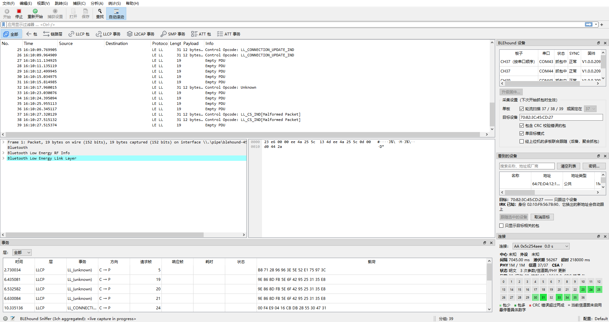

The packet list is Wireshark's, with two additions: a **Payload** column and a time
format menu on the **Time** column header. The status bar shows which interface is
capturing.

With three boards the aggregated capture guards all three advertising channels at once,
time-aligns the boards through the SYNC line, de-duplicates packets heard by more than
one board and follows connections on all boards in parallel. A single board can be
captured on its own from its own interface.

### Layer toolbar

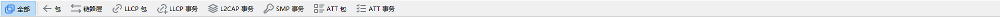

One click applies a display filter for a protocol layer: **All**, **Packets**,
**Link layer**, **LLCP packets**, **LLCP transactions**, **L2CAP transactions**,
**SMP transactions**, **ATT packets** and **ATT transactions**. The generated filter is
shown in the filter bar, so it can be edited further.

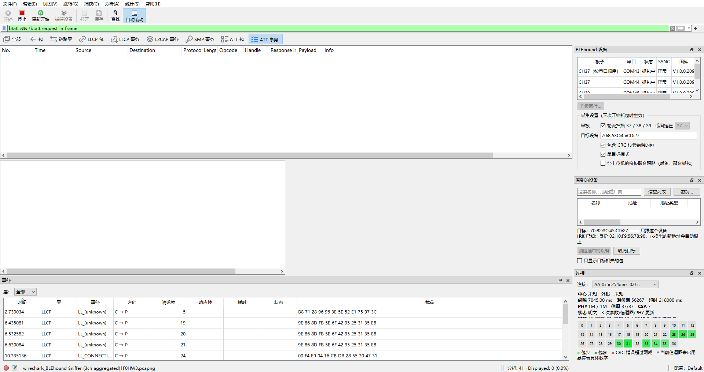

### Connection panel

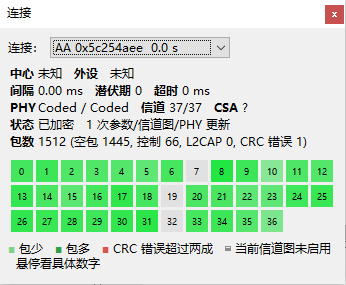

Pick a connection (by access address) to see its central and peripheral, interval,
latency and supervision timeout, PHY, channel, channel selection algorithm, whether it
is plaintext, encrypted or being decrypted, and how many parameter / channel map / PHY
updates it went through. The **heat map** shows the 37 data channels: green cells carry
packets (light: few, dark: many), red cells have more than 20 % CRC errors, hatched
cells are not in the current channel map. Hover a cell for the numbers.

### Transactions panel

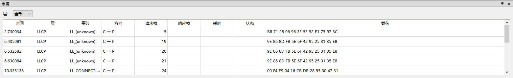

Request/response pairs across LLCP, L2CAP, SMP and ATT, with the frame numbers of
both halves, direction (central → peripheral or back), duration, status
(*ok*, *pending*, *timeout*, *Pairing Failed*) and payload. Use the **Layer** box to
show one protocol only; double-click a row to jump to the frame.

## Firmware update

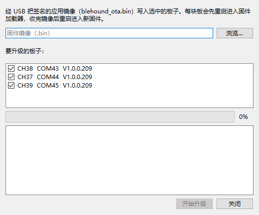

**Update firmware…** in the device panel flashes a signed application image
(`blehound_ota.bin`) over USB: pick the image, tick the boards, press **Start update**.
Each board is switched into its firmware loader, the image is uploaded over SMP, the
board restarts and the dialog waits for the sniffer to enumerate again — about five
seconds per board. Stop any running capture first.

## Capture options

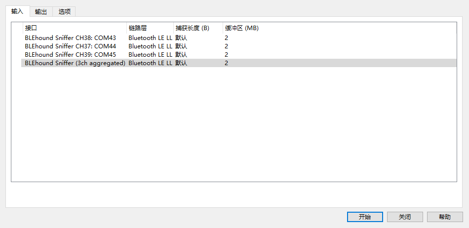

The capture options dialog is reduced to what applies to a BLE sniffer: interfaces,
snapshot length and buffer size, output files and stop conditions. Promiscuous mode,
BPF capture filters and remote interfaces are hidden.

## About

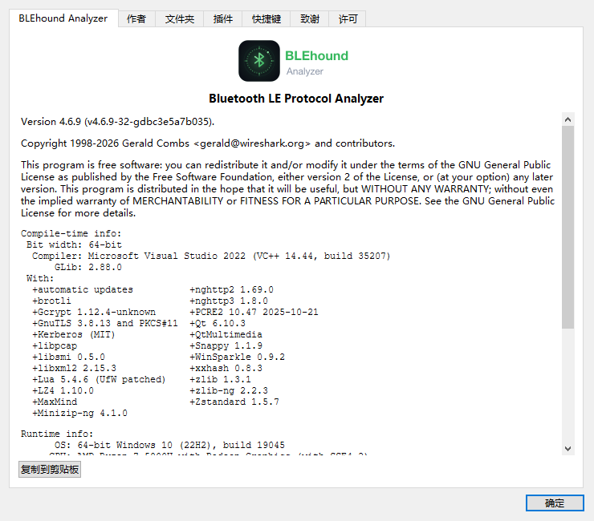

**Help → About BLEhound Analyzer** shows the version, build information and the
libraries in use; the Help menu also links straight to *BLEhound Documentation*,
*Quick Start* and *Report an Issue*.

## Where things are stored

- Settings and keys: `%APPDATA%\BLEhound Analyzer` on Windows,
  `~/.config/blehound-analyzer` on macOS/Linux — separate from Wireshark's own profile.
- Capture files are ordinary pcapng with `LINKTYPE_BLUETOOTH_LE_LL_WITH_PHDR`; stock
  Wireshark opens them too.

## Building from source

The app lives in the `blehound/4.6` branch of the Wireshark fork; build notes for
macOS and Windows are in its `BLEHOUND.md`.
