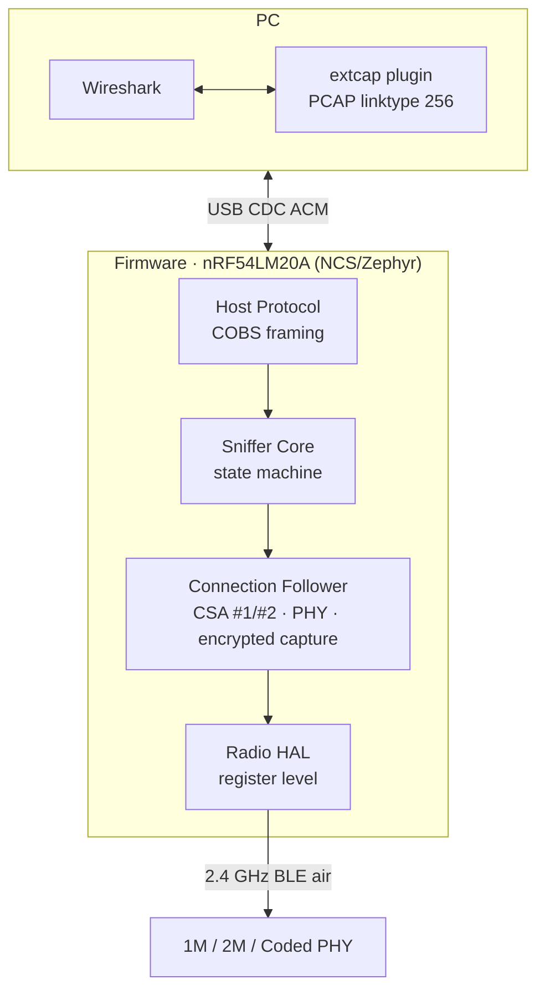
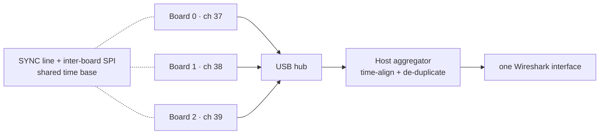

# How it works

BLEhound is deliberately built on a **direct radio driver** rather than Nordic's
sniffer firmware. Owning the radio configuration is what makes the deeper features
possible.



## Pipeline

```
 nRF radio ─► firmware (de-whiten, CRC, timestamp) ─► COBS frames over USB
     ─► host extcap (de-frame, build PCAP) ─► Wireshark dissectors
```

Each captured packet carries channel, RSSI, a microsecond hardware timestamp, CRC
result, PHY, and access address. The host wraps it as
`LINKTYPE_BLUETOOTH_LE_LL_WITH_PHDR` so Wireshark's own Bluetooth dissectors decode
the full stack (advertising PDUs, LL control, L2CAP, ATT/GATT, SMP).

Each captured packet is streamed to the host as a little-endian frame:

| Offset | Len | Field | Description |
|---|---|---|---|
| 0 | 1 | `type` | frame type (packet) |
| 1 | 1 | `flags` | capture flags |
| 2 | 4 | `timestamp_us` | µs timestamp when the access address was received |
| 6 | 1 | `channel` | BLE channel index 0–39 |
| 7 | 1 | `rssi` | int8 dBm |
| 8 | 1 | `phy` | 0=1M 1=2M 2=Coded S8 3=Coded S2 |
| 9 | 4 | `access_addr` | `0x8E89BED6` for advertising, else the connection AA |
| 13 | 3 | `crc` | received 24-bit CRC (raw) |
| 16 | 1 | `pdu_len` | PDU byte count |
| 17 | N | `pdu` | full LL PDU: header + length + payload |

The host reorders `access_addr + pdu + crc` into the link-layer frame that Wireshark's `LINKTYPE_BLUETOOTH_LE_LL_WITH_PHDR` expects.

## Connection following

After a valid `CONNECT_IND`, the firmware computes the hop sequence (CSA #1 or #2) and
follows the connection:

- Re-anchors on actually-received packets to resist clock drift (anchor error stays
  within ~1 µs over long runs).
- Applies channel-map and connection-parameter updates at the correct `instant`,
  including `WinOffset` re-anchoring.
- Follows in-connection PHY updates (1M / 2M / Coded), including asymmetric per-event
  PHY.
- Follows connections established via extended advertising (`AUX_CONNECT_REQ`).
- Keeps following encrypted links (encryption does not change the hop sequence);
  ciphertext is captured and can be decrypted in Wireshark with the key.

## Three-board synchronization



A single radio hears one channel at a time. Three boards, each guarding 37 / 38 / 39,
give simultaneous advertising-channel coverage. Two mechanisms keep them coherent:

- **Shared time base.** One board periodically drives a hardware **SYNC** edge; every
  board captures that same physical edge on its own timer and reports the tick with
  each packet. The host `SyncClock` computes per-board offsets and re-bases every
  timestamp onto a reference board.
- **Merge & de-duplicate.** The `Aggregator` orders the three streams on the aligned
  time base and removes duplicates by `(access address, CRC, PDU)` within a window
  smaller than the inter-frame spacing, so genuine master/slave packets in the same
  event are kept while cross-board copies of one packet are collapsed.

Optionally, `FollowRelay` takes a `CONNECT_IND` seen by one board, converts its anchor
to each other board's time base, and injects a follow command so all three track the
same connection in parallel.

## Front-end (FEM)

The hardware uses an nRF21540 PA/LNA. The LNA lifts weak signals above the noise floor
for better sensitivity/range; `src/fem_ctrl.c` handles the FEM control lines.

## Host modules

- `nrf_sniffer_extcap.py` — extcap protocol, serial I/O, COBS de-framing, PCAP output.
- `tri_aggregator.py` — pure logic (no I/O): `SyncClock`, `Aggregator`, `FollowRelay`.
  Runnable self-test: `python3 tri_aggregator.py --selftest`.

## BLE 4.0 – 6.x coverage

Most mainstream features from BLE 4.0 to 6.x are covered (✓ verified on real hardware, ◐ code in place, hardware trigger pending, ✗ not supported or infeasible):

| Feature | Status |
|---|---|
| **Advertising & connection following (BLE 4.x)** | |
| Legacy advertising capture (all PDUs) | ✓ |
| `CONNECT_IND` follow + CSA #1 hopping | ✓ |
| Channel-map update (`LL_CHANNEL_MAP_IND`) | ✓ |
| Connection-parameter update (`LL_CONNECTION_UPDATE_IND`) | ✓ |
| Peripheral latency / supervision-timeout loss detection | ✓ |
| Connection termination (`LL_TERMINATE_IND`) | ✓ |
| Encrypted-link follow (ciphertext streamed) | ✓ |
| Inject LTK → decrypt in Wireshark | ✓ |
| Legacy pairing passive crack (TK → STK) | ✓ |
| **PHY & extended advertising (BLE 5.0)** | |
| 1M PHY | ✓ |
| 2M PHY + switch (`LL_PHY_UPDATE_IND`) | ✓ |
| Coded PHY S2/S8 (auto-detect) | ✓ |
| Asymmetric PHY (per-packet within an event) | ✓ |
| CSA #2 hopping | ✓ |
| Extended-advertising AUX chains | ✓ |
| Connection via extended adv (`AUX_CONNECT_REQ`) | ✓ |
| Periodic-advertising sync (`AUX_SYNC_IND`) | ✓ |
| **LE Audio & periodic (BLE 5.1–5.4)** | |
| BIS broadcast isochronous stream | ✓ |
| CIS connected isochronous stream | ✓ |
| CIS termination (`LL_CIS_TERMINATE_IND`) | ◐ |
| Connection subrating (5.3) | ✓ |
| PAwR subevent 0 + response slots (5.4) | ✓ |
| PAwR all subevents captured | ◐ |
| PAST — periodic sync transfer | ◐ |
| **Latest features (BLE 6.0–6.2)** | |
| Frame-space negotiation (6.0) | ✓ |
| Short connection interval, down to 375 µs (6.2) | ✓ |
| Decision-based advertising filtering (6.0) | ✓ |
| Channel Sounding negotiation PDUs streamed | ✓ |
| Dedicated parsing of new 6.3 LL PDUs | ✗ |
| **Encryption & cracking boundary** | |
| Encrypted-link decryption (known LTK) | ✓ |
| LE Secure Connections key cracking | ✗ |
| Plaintext of encrypted LL control PDUs | ✗ |
| Channel Sounding ranging reconstruction | ✗ |
| RPA resolution without an IRK | ✗ |

**Legend:** ✓ verified on real hardware · ◐ code in place, hardware trigger pending · ✗ not supported / infeasible by design

- **BLE 4.x:** all legacy advertising PDUs; `CONNECT_IND` follow with CSA #1 hopping; channel-map / connection-parameter updates applied at the correct `instant`; encrypted-link follow (ciphertext streamed, decrypt in Wireshark with the LTK); Legacy pairing (Just Works / Passkey) passive TK → STK recovery.
- **BLE 5.0:** 2M and Coded PHY (S2/S8, connection-following verified), asymmetric per-event PHY, CSA #2; extended-advertising AUX chains and **connections established via `AUX_CONNECT_REQ`**; periodic advertising sync.
- **BLE 5.1 – 5.4:** LE Audio isochronous **BIS / CIS** (per-subevent; ISO ciphertext streamed and reassembled in Wireshark); connection subrating (5.3); **PAwR** (5.4).
- **BLE 6.0 – 6.2:** frame-space negotiation (6.0); short connection intervals (6.2, down to 375 µs); decision-based advertising filtering (6.0); Channel Sounding negotiation PDUs — recognized, counted, streamed, without blocking the follow.

**Not captured, two kinds:**

- **Infeasible for any sniffer:** LE Secure Connections keys (the ECDH private key is never on air; you can only inject a known LTK); Channel Sounding *ranging* (phase tones are relative to each device's own oscillator); encrypted LL control PDUs.
- **Not yet / conditional:** the firmware does no CCM decryption (deliberate — decryption lives in Wireshark); resolvable private addresses aren't resolved (no IRK injected); brand-new 6.3 LL PDUs pass through as unknown opcodes for Wireshark to handle.


## Scope & limits

- Multi-board redundancy helps on lossy/marginal links; a clean link is already fully
  captured by one board.
- The follow relay does not apply to extended-advertising connections.
- Encrypted control PDUs cannot be recovered by adding boards — all boards miss the
  same `instant` together.
- LE Secure Connections (BLE 4.2+) cannot be passively decrypted by any sniffer.
