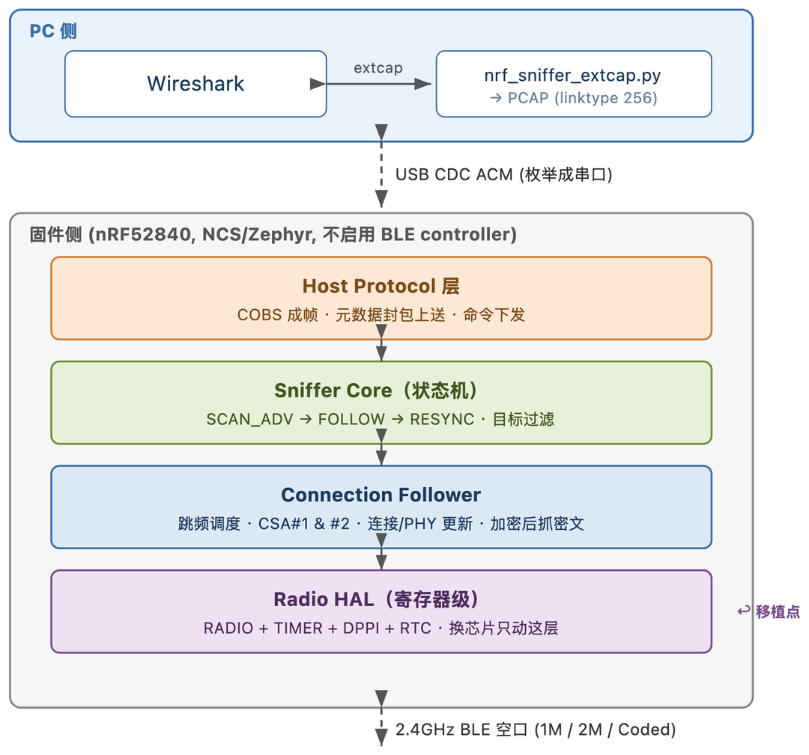
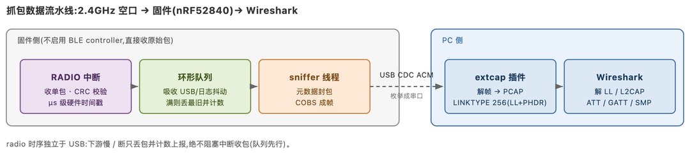
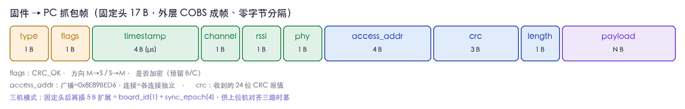
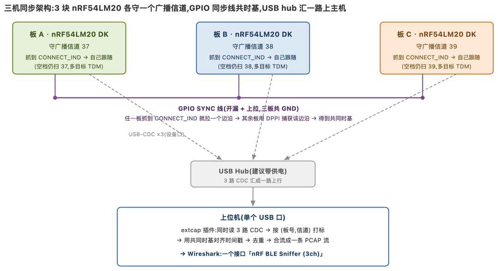
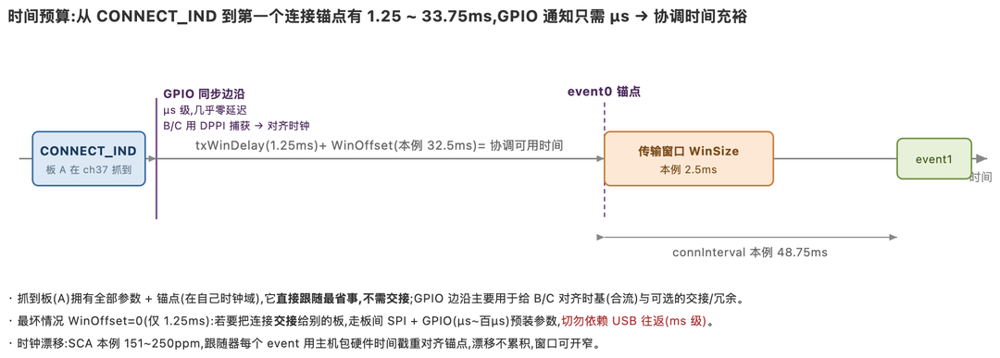
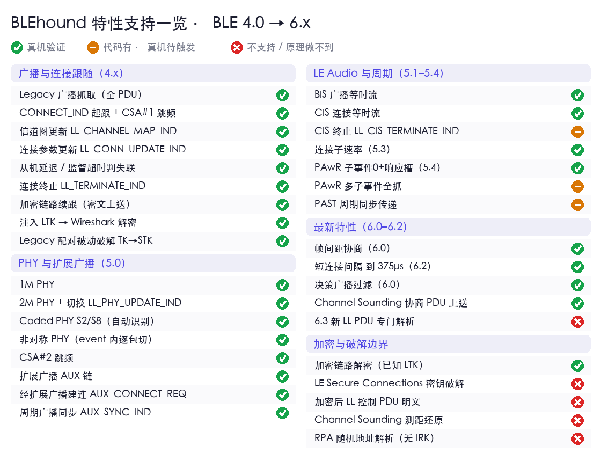

# 工作原理

BLEhound 有意构建在一个**直接射频驱动**之上，而非 Nordic 的嗅探器固件。掌控射频配置正是实现那些更深层特性的关键。



## 处理流水线





```
 nRF radio ─► firmware (de-whiten, CRC, timestamp) ─► COBS frames over USB
     ─► host extcap (de-frame, build PCAP) ─► Wireshark dissectors
```

每个抓取到的数据包都携带信道、RSSI、微秒级硬件时间戳、CRC 结果、PHY 以及接入地址。上位机将其封装为 `LINKTYPE_BLUETOOTH_LE_LL_WITH_PHDR`，使 Wireshark 自带的蓝牙解析器（dissector）能解码完整协议栈（广播 PDU、LL control、L2CAP、ATT/GATT、SMP）。

## 连接跟踪

在收到有效的 `CONNECT_IND` 之后，固件计算跳频序列（CSA #1 或 #2）并跟踪该连接：

- 在实际收到的数据包上重新锚定（re-anchor），以抵抗时钟漂移（长时间运行下锚点误差保持在约 1 µs 以内）。
- 在正确的 `instant` 应用信道图和连接参数更新，包括 `WinOffset` 重锚定。
- 跟踪连接过程中的 PHY 更新（1M / 2M / Coded），包括每事件不对称的 PHY。
- 跟踪通过扩展广播（`AUX_CONNECT_REQ`）建立的连接。
- 持续跟踪加密链路（加密不改变跳频序列）；密文会被抓取，并可在 Wireshark 中用密钥解密。

## 三板同步





单个射频一次只能听一个信道。三块板分别守护 37 / 38 / 39，就能同时覆盖所有广播信道。有两套机制保持它们协调一致：

- **共享时间基准。** 一块板周期性地驱动一个硬件 **SYNC** 边沿；每块板都在自己的定时器上捕获这同一个物理边沿，并在每个数据包中报告该计时值（tick）。上位机的 `SyncClock` 计算各板偏移，并将每个时间戳重新基准化到一块参考板上。
- **合并与去重。** `Aggregator` 在对齐后的时间基准上对三路数据流排序，并在一个小于帧间间隔的窗口内按 `(access address, CRC, PDU)` 去除重复项，从而保留同一事件中真正的主／从数据包，同时将同一数据包的跨板副本合并掉。

可选地，`FollowRelay` 取用某块板看到的 `CONNECT_IND`，将其锚点转换到其他各板的时间基准，并注入一条跟踪命令，使三块板并行跟踪同一条连接。

## 前端（FEM）

硬件使用一颗 nRF21540 PA/LNA。LNA 将微弱信号抬升到噪声底之上，以获得更好的灵敏度／覆盖距离；`src/fem_ctrl.c` 负责处理 FEM 控制线。

## 上位机模块

- `nrf_sniffer_extcap.py` —— extcap 协议、串口 I/O、COBS 解帧、PCAP 输出。
- `tri_aggregator.py` —— 纯逻辑（无 I/O）：`SyncClock`、`Aggregator`、`FollowRelay`。可运行的自测：`python3 tri_aggregator.py --selftest`。

## BLE 4.0 – 6.x 覆盖清单

从 4.0 到最新的 6.x，主流特性基本都覆盖（✓ 真机验证 / ◐ 代码已就位、真机待触发 / ✗ 不支持或原理做不到）：



- **BLE 4.x 基础：** 全部 legacy 广播 PDU；抓到 `CONNECT_IND` 起跟、CSA #1 跳频；信道图 / 连接参数更新按 instant 生效；加密链路续跟（密文上送，注入 LTK 后在 Wireshark 解明文）；Legacy 配对（Just Works / Passkey）被动暴破 TK → STK。
- **BLE 5.0：** 2M / Coded PHY（S2/S8 自动识别，连接跟随过真机）、非对称 PHY、CSA #2；扩展广播 AUX 链；**经扩展广播建连**（`AUX_CONNECT_REQ`）；周期广播同步。
- **BLE 5.1 ~ 5.4：** LE Audio 等时流 **BIS / CIS**（逐 subevent 收，ISO 密文上送、在 Wireshark 重组）；连接子速率（5.3）；**PAwR**（5.4）。
- **BLE 6.0 ~ 6.2：** 帧间距协商（6.0）；短连接间隔（6.2，可到 375 µs）；决策广播过滤（6.0）；Channel Sounding 协商族——识别、计数、原样上送，不挡跟随。

**抓不到的分两种：**

- **原理上任何 sniffer 都做不到：** LE Secure Connections 的密钥（ECDH 私钥拿不到，只能注入已知 LTK）；Channel Sounding 的**测距**（相位 tone 相对各自本振，第三方还原不出）；加密后的 LL 控制 PDU。
- **暂未实现 / 有条件：** 固件内不做 CCM 解密（故意——统一放 Wireshark）；随机可解析地址（RPA）不解析（未注入 IRK）；6.3 全新 LL PDU 以未知 opcode 原样上送、交给 Wireshark。


## 适用范围与局限

- 多板冗余在有损／临界链路上有帮助；对于干净的链路，单块板已能完整抓取。
- 跟踪接力不适用于扩展广播的连接。
- 加密的控制 PDU 无法通过增加板数来恢复 —— 所有板会在同一个 `instant` 一起漏掉。
- LE Secure Connections（BLE 4.2+）无法被任何嗅探器被动解密。
