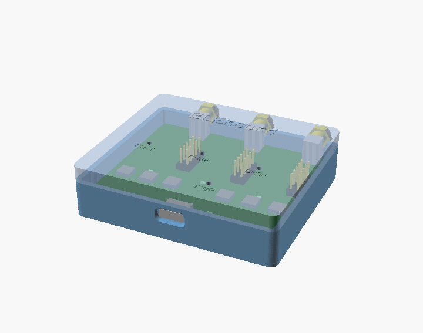
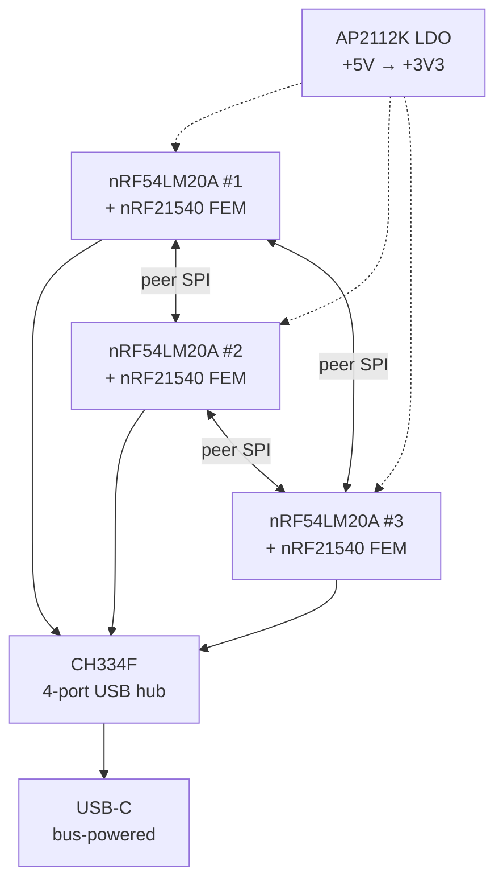
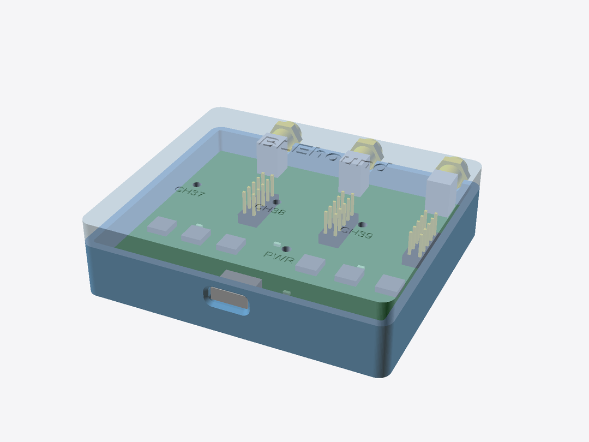
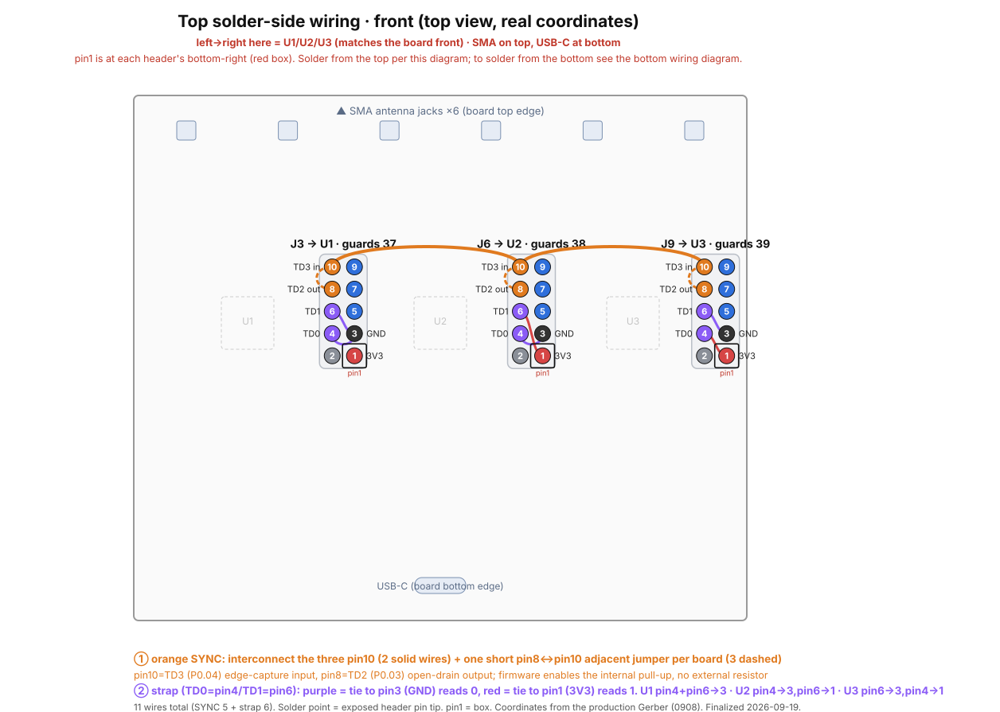

# Hardware

Open hardware for the BLEhound sniffer: a USB dongle around the **nRF54LM20A** SoC
with an **nRF21540** front-end module (PA/LNA) for improved range and sensitivity.
Licensed under CERN-OHL-S-2.0. Files:
[`hardware/`](https://github.com/BLEhound/BLEhound/tree/main/hardware).

## Which version to use

| Folder | Status | Use it? |
|---|---|---|
| `hardware/v1/` | **The only fabricated board so far** (JLCEDA 0908): Gerbers, BOM, pick-and-place, assembly, JLCEDA Pro source | ⚠️ Known defects — 3-board needs rework (single-board OK) |
| `hardware/v2-wip/` | Revision that folds V1's fixes into the PCB — **routing not finished** | ❌ Do not fabricate |
| `hardware/case/` | 3D-printed enclosure (OpenSCAD + STL + sliced 3MF), version-independent | ✅ Shared |

## Board at a glance

- **SoC:** nRF54LM20A (BLE 5.x/6.x). Firmware also runs on nRF52840.
- **Front-end:** nRF21540 FEM (PA + LNA) — better link budget than bare-radio sniffers.
- **Host:** USB CDC serial to the PC / Wireshark.
- **USB hub:** a CH334F combines the three SoCs' USB onto one USB-C port. It runs on
  its internal oscillator (XI / pin 4 to GND) and is bus-powered (PSELF / pin 18 left
  floating, never GND) — see the [V1 README](https://github.com/BLEhound/BLEhound/tree/main/hardware/v1) for the strap detail.
- **Multi-board:** per-board SWD header, plus a SYNC line + inter-board SPI so three
  boards can be time-aligned for [multi-channel capture](usage-multichannel.md).

## Hardware design

The board is a USB dongle: **3× nRF54LM20A + nRF21540 FEM**, 70 × 60 mm, 6-layer with first-order HDI blind vias. Design notes:

- **One nRF21540 FEM (PA/LNA) per SoC**, dual antenna ports on SMA (ANT2 unpopulated by default); the RF-cluster layout follows Nordic's EK/DK reference to avoid matching pitfalls.
- **Shared time base over one open-drain SYNC line:** any board pulls the line low on an edge; all three hardware-capture the same physical edge — internal pull-up, no external resistor.
- **Peer-to-peer inter-board SPI:** the three boards are pairwise linked (AB / BC / CA, 4 wires + 1 REQ each), one master port and one slave port per board — no shared bus.
- **USB 3-in-1:** a CH334F 4-port hub merges the three USB-CDC links onto one USB-C upstream port; the unit is bus-powered (CC 5.1k pulldowns) and an AP2112K LDO turns +5V into +3V3 for the three SoCs, three FEMs, and the hub.
- RF passives use the reference 0201 footprints (swapping to larger packages breaks the copied coordinates).

## Rebuilding V1

Send `hardware/v1/gerbers/` to a PCB fab (JLCPCB, PCBWay, …); provide `bom.csv` and
`pick-and-place/` for assembly. The design source is the JLCEDA Pro project in
`hardware/v1/jlceda-source/` (`.epro2` = source of truth; `.epro` = the format KiCad
can import via **File → Import → EasyEDA/JLCEDA Pro Project**, which is GUI-only).

## V1 known issues (first-batch rework)

The first batch has two pin-level errors that block **three-board** mode
(single-board sniffing is unaffected):

1. **SYNC on P2.01** — P2 is the only nRF54LM20A port without GPIOTE, so edge capture
   fails (`sync_line: -134 ENOTSUP`); three-board time-sync is inoperable as fabricated.
2. **Strap wiring** gives duplicate/incorrect board roles — no board guards channel 37.

Both are fixed with 11 flying wires on the SWD debug headers (SYNC → P0.04/P0.03,
straps → P1.08/P1.09). Full wiring diagram and role table:
[`hardware/v1/README.md`](https://github.com/BLEhound/BLEhound/tree/main/hardware/v1).

The **V2** revision integrates these fixes into the PCB (routing unfinished). **For working three-board hardware, wait for V2 or use a reworked V1** — a plain V1 build is single-board only.
