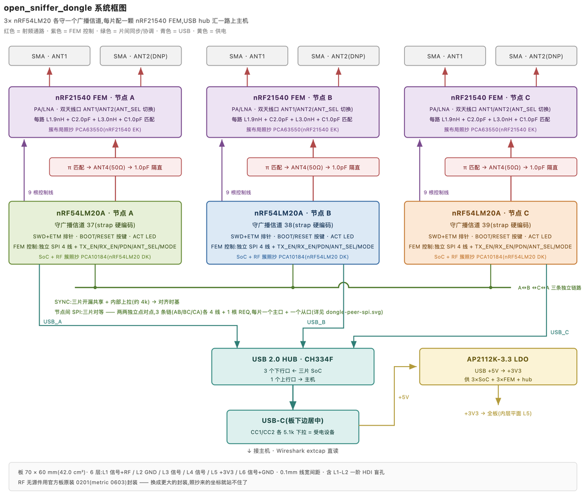
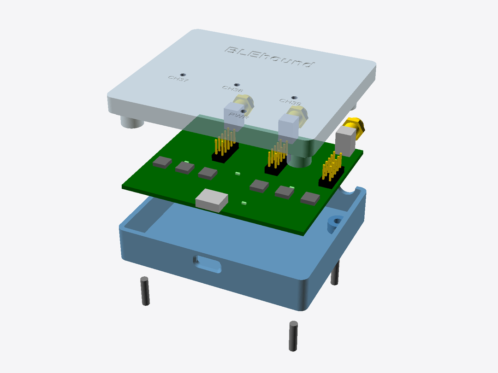
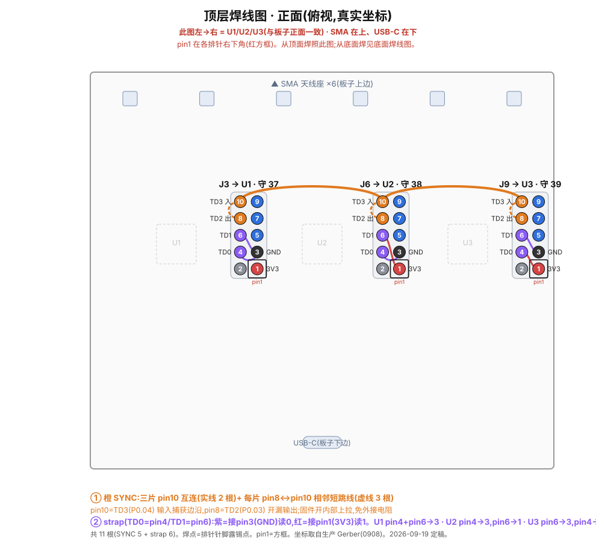

# 硬件

BLEhound 嗅探器的开源硬件:围绕 **nRF54LM20A** SoC + **nRF21540** 前端模块(PA/LNA,提升距离与灵敏度)的 USB dongle。许可证 CERN-OHL-S-2.0。文件:
[`hardware/`](https://github.com/BLEhound/BLEhound/tree/main/hardware)。

## 用哪个版本

| 文件夹 | 状态 | 用它吗? |
|---|---|---|
| `hardware/v1/` | **目前唯一投产的板子**(嘉立创 0908):Gerber、BOM、坐标、装配、嘉立创专业版源 | ⚠️ 有已知缺陷——三机需返工(单片可用) |
| `hardware/v2-wip/` | 把 V1 修正做进 PCB 的改版——**布线未完成** | ❌ 不要投产 |
| `hardware/case/` | 3D 打印外壳(OpenSCAD + STL + 切片 3MF),与版本无关 | ✅ 通用 |

## 板子概览

- **SoC:** nRF54LM20A(BLE 5.x/6.x)。固件也能跑在 nRF52840 上。
- **前端:** nRF21540 FEM(PA + LNA)——链路预算优于裸电台嗅探器。
- **主机:** USB CDC 串口到 PC / Wireshark。
- **USB hub:** CH334F 把三颗 SoC 的 USB 汇到一个 USB-C 口。用片内振荡器(XI / 4 脚接地)、总线供电(PSELF / 18 脚悬空,绝不接地)——strap 细节见 [V1 README](https://github.com/BLEhound/BLEhound/tree/main/hardware/v1)。
- **多板:** 每片 SWD 排针,外加 SYNC 线 + 片间 SPI,三片可对齐时基做[多信道捕获](usage-multichannel.md)。

## 硬件设计

板子是 3× nRF54LM20A + nRF21540 FEM 的 USB dongle，70 × 60 mm、6 层、含一阶 HDI 盲孔。几处讲究：

- **每片 SoC 配一颗 nRF21540 FEM（PA/LNA）**，双天线口用 SMA（ANT2 默认不贴）；射频簇布局布线照抄 Nordic 官方 EK/DK，少踩匹配的坑。
- **一根开漏 SYNC 线共享时基：** 任一片抓到边沿就把线拉低，三片用硬件同时捕获同一个物理边沿——内部上拉、免外接电阻。
- **片间对等 SPI：** 三片两两点对点（AB / BC / CA，各 4 线 + 1 根 REQ），每片一主口一从口，不走共享总线。
- **USB 三合一：** CH334F 4 口 hub 把三片的 USB-CDC 汇到一个 USB-C 上行口；整机总线供电（CC 各 5.1k 下拉），AP2112K LDO 把 +5V 转 +3V3，供三片 SoC + 三颗 FEM + hub。
- 射频无源件沿用官方 0201 封装（换更大封装，照抄来的坐标就站不住了）。

再配一个参数化 3D 打印外壳（OpenSCAD 源码 + STL + 切片文件都在）：

## 复制 V1

把 `hardware/v1/gerbers/` 发给 PCB 厂(JLCPCB、PCBWay 等);贴片提供 `bom.csv` 与 `pick-and-place/`。设计源是 `hardware/v1/jlceda-source/` 里的嘉立创专业版工程(`.epro2` = 真理源;`.epro` = KiCad 能导入的格式,经**文件 → 导入 → EasyEDA/JLCEDA Pro Project**,仅 GUI 可用)。

## V1 已知问题(首批返工)

首批板有两处引脚级错误,卡住**三机**模式(单片抓包不受影响):

1. **SYNC 落在 P2.01** —— P2 是 nRF54LM20A 唯一没有 GPIOTE 的口,边沿捕获失败(`sync_line: -134 ENOTSUP`),三机时基对齐无法工作。
2. **strap 接法**致板角色重复/错位——没有一片守信道 37。

两者用调试排针 **11 根飞线**修正(SYNC → P0.04/P0.03、strap → P1.08/P1.09)。完整接线图与角色表见
[`hardware/v1/README.md`](https://github.com/BLEhound/BLEhound/tree/main/hardware/v1)。

**V2** 改版把这些修正做进 PCB(布线未完成)。**想要可用的三机硬件,只能等 V2 或用改过的 V1**——原始 V1 只有单片可用。
