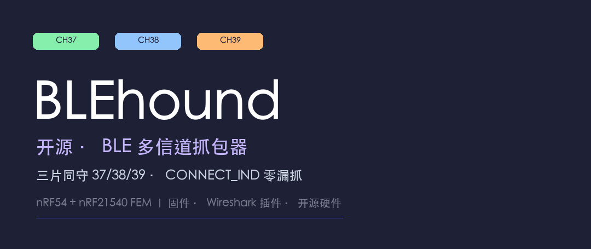

# BLEhound

**基于 nRF54 的开放式、FEM 增强型蓝牙 LE（Bluetooth LE）嗅探器 —— 支持同步多信道抓包。**

BLEhound 是一款从零打造的 BLE 嗅探器：包含固件、一个 Wireshark `extcap` 插件以及开放硬件。射频由我们自研的固件驱动（而非 Nordic 官方的嗅探器固件），正是这一点使其能够实现连接跟踪、加密链路抓包以及**三射频同步多信道**抓包。

源代码：[github.com/BLEhound/BLEhound](https://github.com/BLEhound/BLEhound)

## 为什么选择 BLEhound

- **同步多信道抓包（三块板）。** 单个射频一次只能监听一个信道，因此单台嗅探器可能会漏掉落在另一个广播信道上的 `CONNECT_IND`。BLEhound 使用三块板分别守护 37 / 38 / 39 信道，通过硬件 SYNC 同步线加板间 SPI 实现时间对齐，再由上位机合并为**一个** Wireshark 接口。已在真实硬件上完成端到端验证。
- **FEM（nRF21540 PA/LNA）** 带来更佳的灵敏度和覆盖距离。
- **新芯片，现代特性** —— nRF54LM20A（同时支持 nRF52840）：CSA #1/#2 连接跟踪，1M / 2M / Coded PHY 及连接过程中的 PHY 更新，扩展广播（`AUX_CONNECT_REQ`），BLE 5.x/6.x 链路层覆盖。
- **完整且可复现** —— 提供 JLCEDA Pro 源文件、Gerber、BOM 以及一套 3D 打印外壳。
- **可兼作低成本 BLE 射频测试台** —— 参见 [射频测试台](rf-test-bench.md)。

## 客观的适用范围

- 作为单块板，它与 [Sniffle](https://github.com/nccgroup/Sniffle) 和 Nordic nRF Sniffer 处于同一层次；其优势在于 FEM、更新的芯片以及集成化的硬件。
- 多板冗余在有损／临界链路上收益最大；对于干净的链路，单块板已能完整抓取。
- 三板接力不适用于扩展广播建立的连接，也无法恢复加密的控制 PDU。

## 开始使用

- :material-rocket-launch: **[快速上手](quickstart.md)** —— 从零到在 Wireshark 中看到数据包
- :material-chip: **[构建固件](build-firmware.md)** —— west / nRF Connect SDK
- :material-shark: **[配合 Wireshark 使用](usage-wireshark.md)** —— extcap 插件
- :material-access-point-network: **[多信道](usage-multichannel.md)** —— 三板搭建
- :material-developer-board: **[硬件](hardware.md)** —— 订购并组装 dongle
- :material-cog: **[工作原理](architecture.md)** —— 设计详解

## 基本是 AI 做的

坦白讲：这个项目的**原理图设计、3D 外壳、软件的调试与测试**，绝大部分是 AI（人在旁边把关）完成的。开源出来，一方面是工具本身有用，另一方面也想留个真实样本——AI 能把这类软硬件项目推到什么程度。

但正因为如此，有句话必须提醒：

> **AI 设计的原理图，不能完全相信；每一个细节都要自己追着问、对着数据手册逐条核。**

这块板的 V1 就是活教材——被 AI 想当然放过去、后来一条条揪出来的坑就有四处：

- **SYNC 放到了 P2 口** —— 可 P2 恰恰是这颗芯片上唯一没有 GPIOTE、做不了边沿捕获的口，三片时基根本对不齐。
- **strap 接法接错** —— 两片读到同一角色，导致没有一片守 37。
- **USB hub（CH334F）时钟** —— 它能用片内振荡器（XI/4 脚接地），却被外挂了晶振；其实根本不用。
- **USB hub 供电** —— 总线供电的板子 PSELF（18 脚）必须悬空，却接成了地；接地 = 自供电模式，hub 会枚举失败，整块 dongle 都认不出来。

这些都不是玄学 bug，而是没有逐脚翻数据手册的结果。你若也用 AI 做硬件，务必对它出的每一张原理图较真。

## 许可与合规

代码：Apache-2.0。硬件：CERN-OHL-S-2.0。BLEhound 包含针对传统配对（Legacy pairing）的分析工具；仅可在你拥有或已获授权测试的设备上使用。LE Secure Connections（BLE 4.2+）无法被任何嗅探器被动破解。
