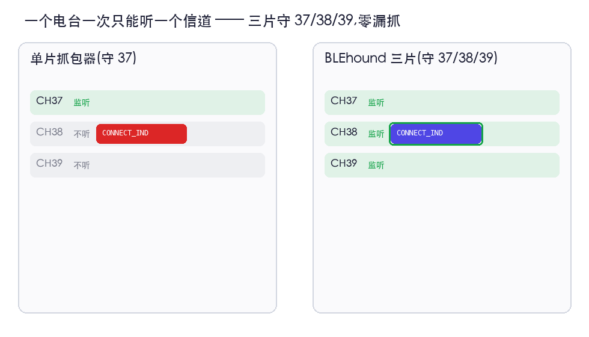

# 多信道抓包（三块板）

单个 BLE 射频一次只能监听一个信道。因此单台嗅探器守在某一个广播信道上时，可能会漏掉落在另外两个信道之一上的 `CONNECT_IND` —— 于是就再也看不到那条连接了。

BLEhound 用**三块板**解决这个问题：每块板固定守护一个广播信道（37 / 38 / 39），经时间对齐后由上位机合并为一路 Wireshark 数据流。



## 系统如何协同

```
 board 0 (ch 37) ─┐
 board 1 (ch 38) ─┤─ USB ─►  host aggregator ─► one Wireshark interface
 board 2 (ch 39) ─┘             (time-align + de-duplicate)
        │
        └── SYNC line + inter-board SPI  (shared time base)
```

- 每块板给数据包打上自己的 `board_id` 以及最近一次 SYNC 边沿的计时值（tick）。
- 上位机的 `SyncClock` 对三条时间线进行对齐；`Aggregator` 按 `(access address, CRC, PDU)` 合并并去重。
- 可选地，当某块板捕获到 `CONNECT_IND` 时，上位机将连接参数中继给另外两块板，使三块板并行跟踪同一条连接（`FollowRelay`）。

## 接线

按硬件说明将各板的 SYNC 线连接在一起，并连好板间 SPI。给三块板烧录相同的固件；每块板的角色（守护哪个信道）通过跳线／角色配置（strap/role config）指定。

## 抓包

1. 安装 extcap（参见 [配合 Wireshark 使用](usage-wireshark.md)）。
2. 在 Wireshark 中，选择 **nRF BLE Sniffer (3ch aggregated)** 接口。
3. （可选）启用三板跟踪接力，并设置目标 MAC。
4. 开始抓包 —— 你将得到一路合并、去重、时间一致的数据流。

从命令行（例如用于脚本化运行）：

```bash
python3 host/tri_aggregator.py --selftest      # verify the merge logic
```

## 它能带来什么、不能带来什么

- **广播覆盖：** 有了三块板，无论 `CONNECT_IND` 落在哪个信道上，你都不会漏掉它。
- **抗丢包：** 各板的天线位置／噪声互相独立，所以某块板丢的包，另一块板可能仍然收到 —— 合并后的数据流保持连续。这在有损／临界链路上收益最大（实测：更高的存活率，相比单块板零早期断连）。
- **局限：** 在干净链路上，单块板已能抓到一切；接力**不适用于**通过扩展广播（`AUX_CONNECT_REQ`）建立的连接；且它无法恢复加密的控制 PDU（所有板会在同一个 `instant` 一起漏掉）。
